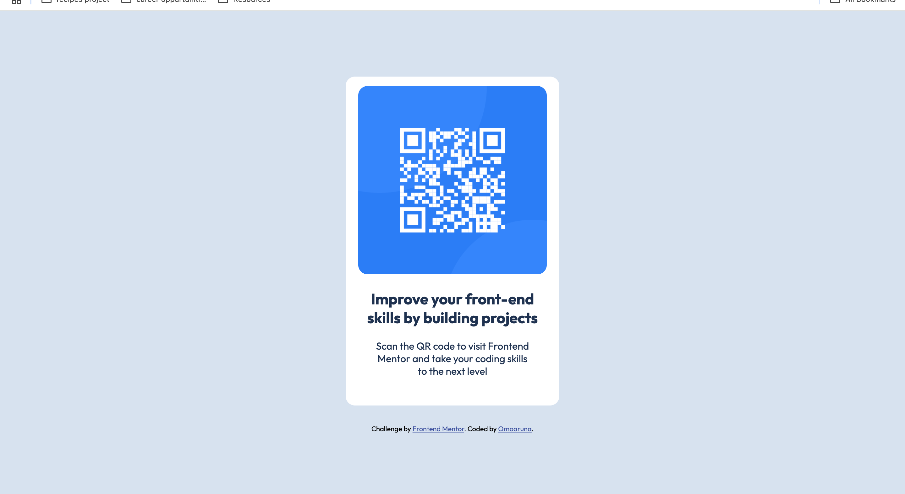
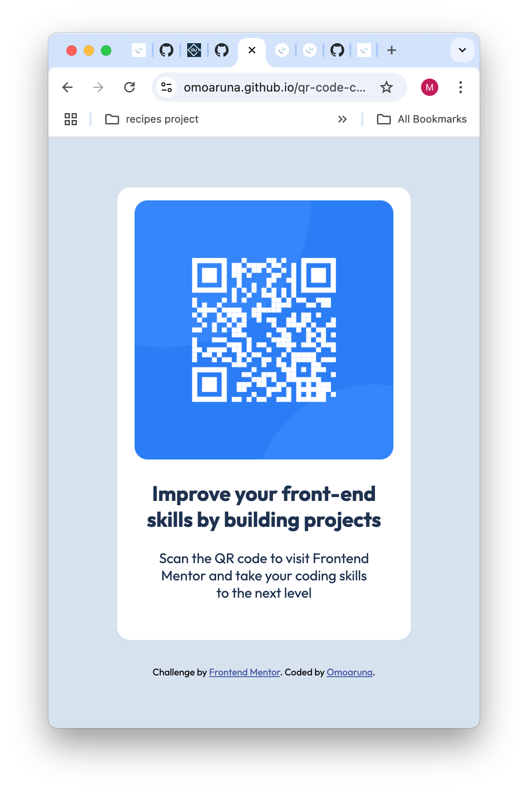

# Frontend Mentor - QR code component solution

This is a solution to the [QR code component challenge on Frontend Mentor](https://www.frontendmentor.io/challenges/qr-code-component-iux_sIO_H). Frontend Mentor challenges help you improve your coding skills by building realistic projects. 

## Table of contents

- [Overview](#overview)
  - [Screenshot](#screenshot)
  - [Links](#links)
- [My process](#my-process)
  - [Built with](#built-with)
  - [What I learned](#what-i-learned)
  - [Continued development](#continued-development)
- [Author](#author)
- [Acknowledgments](#acknowledgments)

## Overview

### Screenshot

### Links

- Solution URL: (https://github.com/omoaruna/qr-code-component)
- Live Site URL: (https://omoaruna.github.io/qr-code-component/)
## My process
- Firstly, I Read through the original README file and the style-guide
- Added my external stylesheet
- Embedded the code for the Google Font
- From my thought process the image is a body with light blue background, then a section for the  QR code, as well as a footer
- The QR code section is divided in two; the QR image itself and the content
- Everything on the page is centered vertically and horizontally
- The image and the QR section have rounded borders.

### Using Flexbox
- I used Flexbox to vertically center the section
- I also used Flexbox to center all content inside the section

### Built with
- Semantic HTML5 markup
- Flexbox

### What I learned
Not much honestly, but I got to practice what I know so hopefully I learned something subconsciously

### Continued development

My problems areanis :
- Manipulating width sizes without hard-coding anything, especially with sentences that take up the complete width space.

## Author

- Website - [Omoaruna](https://github.com/omoaruna)
- Frontend Mentor - [@omoaruna](https://www.frontendmentor.io/profile/omoaruna)
- Twitter - [@dotomoll](https://www.twitter.com/dotomoll)

## Acknowledgments
All my thanks to The Odin Project.
